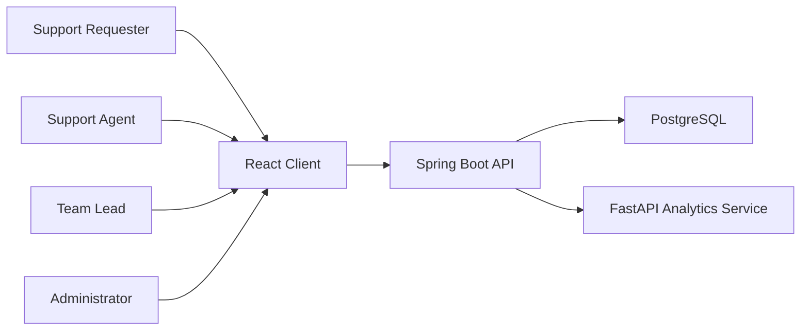
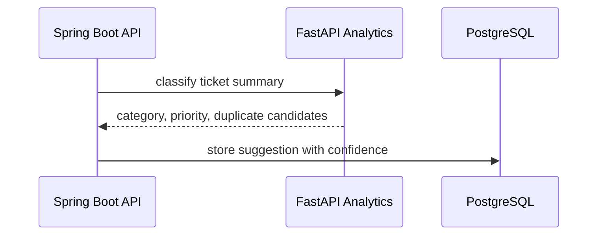

# Architecture

Current status: planning only.

## System Context

## Frontend

The planned frontend is a React TypeScript client for ticket forms, ticket lists, filters, search, Kanban workflow, dashboards, and admin screens.

## Backend

The planned backend is a Spring Boot API. It owns authentication, authorization, ticket workflow rules, comments, activity history, audit logging, and persistence.

## Analytics

The planned analytics service is a small FastAPI service for category suggestion, priority recommendation, duplicate detection, and reporting endpoints. It is not a production-scale machine learning platform.

## Database

PostgreSQL is planned for users, roles, tickets, comments, activities, assignments, categories, analytics suggestions, sessions or refresh tokens, and audit logs.

## Docker

Docker Compose is planned for local demo orchestration. Production deployment is not implemented in this stage.

## Request Flow

1. User interacts with the React client.
2. Client sends authenticated requests to the Spring Boot API.
3. API validates input and enforces role permissions.
4. API persists changes in PostgreSQL.
5. API optionally requests suggestions from the analytics service.
6. API returns normalized data to the frontend.

## Authentication Flow

1. User registers or logs in.
2. Backend hashes passwords and issues a session or token.
3. Frontend stores only the approved client-side credential material.
4. Backend checks role permissions on every protected endpoint.
5. Logout invalidates the active session or token.

## Ticket Creation Flow

1. Requester opens the ticket form.
2. Frontend validates required fields.
3. Backend validates and stores the ticket.
4. Backend writes activity history.
5. Optional analytics suggestions are stored as suggestions, not automatic truth.

## Analytics Suggestion Flow

## Audit Flow

Every ticket change should append an immutable activity record with actor, action, timestamp, changed fields, and request context where safe.

## Deployment Topology

The planned demo topology uses a hosted frontend, backend service, analytics service, and managed or containerized PostgreSQL. HTTPS, CORS, health checks, logs, and rollback are required before public demo use.

## Trade-Offs

- A modular monolith backend is preferred over a large microservice architecture for MVP speed.
- Analytics remains a small service so the core ticket workflow can stay reliable.
- Suggestions assist agents but do not automatically change ticket truth.

## Future Expansion

- SLA reporting.
- Organization-level teams.
- Advanced duplicate clustering.
- Notification integrations.
- More granular audit exports.
