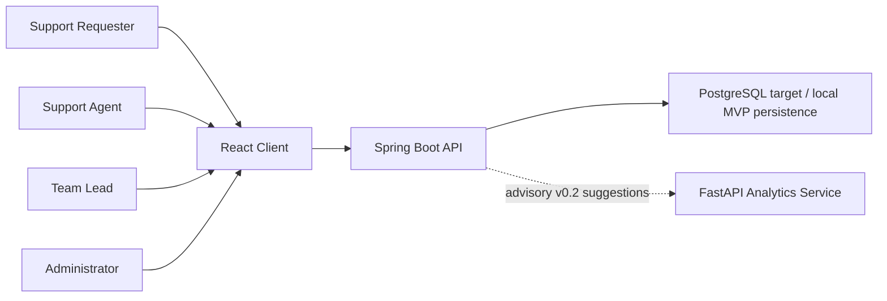
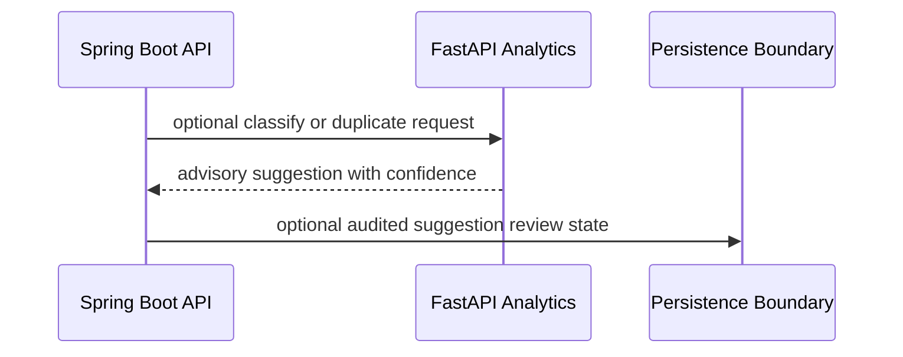

# Architecture

Completed baseline roadmap mode: `PORTFOLIO_FIRST_V0_1`.

Current live roadmap mode: `ANALYTICS_ASSISTED_V0_2`.

Current status: ResolveHub Portfolio-first v0.1 is complete on `origin/main`.
`origin/main` contains the frontend scaffold, Spring Boot backend, auth/RBAC,
ticket backend workflow, ticket frontend workflow, Kanban, dashboard backend
APIs, dashboard UI, FastAPI health scaffold, Docker Compose foundation, GitHub
Actions CI, scoped #26 quality gates, and scoped #27 demo/release packaging.
The v0.2 roadmap is active. Issue #23 adds deterministic advisory category and
priority suggestions inside the analytics service, Issue #24 adds deterministic
advisory duplicate ticket suggestions, and Issue #25 integrates suggestion
review into the ticket workflow.

## System Context

```mermaid
flowchart LR
  Requester["Support Requester"] --> Frontend["React Client"]
  Agent["Support Agent"] --> Frontend
  Lead["Team Lead"] --> Frontend
  Admin["Administrator"] --> Frontend
  Frontend --> Backend["Spring Boot API"]
  Backend --> DB["PostgreSQL target / local MVP persistence"]
  Backend -. "advisory v0.2 suggestions" .-> Analytics["FastAPI Analytics Service"]
```

## Implementation State

| Area | Current state |
|---|---|
| Frontend shell, routes, ticket workspace, Kanban | MERGED |
| Authentication/RBAC backend | MERGED |
| Ticket create/detail/update/search/filter backend | MERGED |
| Assignment, comments, and activity history backend | MERGED |
| Dashboard summary/trend backend APIs | MERGED |
| Dashboard UI | MERGED via PR #48 |
| FastAPI analytics health scaffold | MERGED |
| Category/priority suggestion service | IMPLEMENTED_V0_2_CORE via Issue #23 |
| Duplicate suggestion | IMPLEMENTED_V0_2_CORE via Issue #24 |
| Full analytics workflow integration | IMPLEMENTED_V0_2_CORE via Issue #25 |
| Integrated E2E/accessibility/security gates | MERGED via PR #51 |
| Docker demo and portfolio release package | MERGED via PR #52 |

## Frontend

The React TypeScript client owns the user-facing ticket workflow. `origin/main`
includes the ticket workspace, Kanban surface, and dashboard route. The
dashboard renders summary tiles, distribution charts, trend buckets, and
responsive dashboard states from the backend dashboard APIs. Authentication UI
remains a frontend integration gap even though backend auth/RBAC exists.

## Backend

The Spring Boot API owns authentication, authorization, ticket workflow rules,
comments, activity history, dashboard aggregation, and the source-of-truth
ticket data. `origin/main` contains the core workflow and dashboard endpoints.

## Analytics

The FastAPI analytics service exposes a health endpoint, an Issue #23
category/priority suggestion endpoint, and an Issue #24 duplicate suggestion
endpoint. Under `ANALYTICS_ASSISTED_V0_2`, analytics work proceeds serially:

- Issue #23 category/priority suggestion service.
- Issue #24 duplicate suggestion.
- Issue #25 full analytics workflow integration through the backend/frontend
  ticket workflow.

Analytics suggestions remain advisory. They must not automatically mutate ticket
truth or store private ticket content.

## Database

PostgreSQL remains the target persistence model for users, roles, tickets,
comments, activities, assignments, categories, analytics suggestions, sessions
or refresh tokens, and audit logs. Current backend slices use local MVP
persistence where PostgreSQL integration is not yet complete.

## Docker And CI

Docker Compose and GitHub Actions foundations are present on `origin/main`.
Portfolio-first v0.1 release readiness includes the merged scoped #27
demo/release validation package.

The local demo release package uses the root `docker-compose.yml`, the
fictional seed manifest in `tests/demo-seed-data.json`, and the validation
script `scripts/validate-demo-release.js`. The package verifies local service
availability, reset instructions, release documentation, and analytics deferral
boundaries without adding production credentials.

## Request Flow

1. User interacts with the React client.
2. Client sends authenticated requests to the Spring Boot API where integration
   exists.
3. API validates input and enforces role permissions.
4. API persists workflow state through the current MVP persistence boundary.
5. API returns normalized data to the frontend.
6. Optional analytics requests remain stretch/v0.2 work unless explicitly
   enabled.

## Authentication Flow

1. User registers or logs in through backend auth endpoints.
2. Backend hashes passwords and issues local MVP session tokens.
3. Frontend integration for authenticated session use remains separate from the
   backend capability.
4. Backend checks role permissions on protected endpoints.
5. Logout invalidates the active session token.

## Ticket Workflow Flow

1. Requester creates a ticket.
2. Backend validates, stores, and exposes the ticket.
3. Support roles triage, assign, comment, and update status/priority.
4. Ticket mutations append activity history.
5. Kanban presents workflow state in the frontend.
6. Dashboard UI reads summary/trend APIs now that #21 and #22 are merged.

## Analytics Suggestion Flow

```mermaid
sequenceDiagram
  participant API as Spring Boot API
  participant Analytics as FastAPI Analytics
  participant DB as Persistence Boundary
  API->>Analytics: optional classify or duplicate request
  Analytics-->>API: advisory suggestion with confidence
  API->>DB: optional audited suggestion review state
```

Issue #23 implements the analytics-service side of this flow for category and
priority suggestions. Issue #24 implements duplicate candidate matching in the
analytics service. Issue #25 adds backend endpoints that request both advisory
suggestion types, degrade when analytics is unavailable, and record explicit
review decisions as safe activity field names only. The frontend ticket detail
surface displays loading, failure, low-confidence, accept, ignore, and override
states without hidden ticket mutation.

## Audit Flow

Every ticket change should append an immutable activity record with actor,
action, timestamp, changed fields, and safe request context. Activity summaries
must not expose tokens, credentials, private ticket bodies, Gmail content,
browser sessions, job-search data, or other private user data.

## Deployment Topology

The portfolio v0.1 demo target is a local Docker Compose stack with frontend,
backend, analytics health service, and database topology. A hosted public demo
is optional future work and requires HTTPS, CORS, secret management, health
checks, and rollback review.

## Trade-Offs

- A modular Spring Boot backend remains preferable to a larger microservice
  split for v0.1.
- Portfolio-first v0.1 prioritizes a coherent full-stack workflow and release
  narrative over full analytics breadth.
- Analytics remains separated so the core ticket workflow can stay reliable.
- Suggestions assist users but never automatically change ticket truth.

## Future Expansion

- Full analytics workflow integration.
- Duplicate clustering.
- SLA reporting.
- Organization-level teams.
- Notification integrations.
- More granular audit exports.

## Analytics-assisted v0.2

The proposed v0.2 architecture keeps the Spring Boot backend as ticket source of
truth and adds advisory analytics through the existing FastAPI service boundary.
The dependency order is #23 category/priority suggestions, then #24 duplicate
suggestions, then #25 backend/frontend workflow integration.

Suggestions must include confidence and explanation fields, remain deterministic
for fixtures, and degrade safely when the analytics service is unavailable. The
backend must not mutate category, priority, status, assignment, closure, or
duplicate state without explicit user action. Frontend surfaces must make
accept, ignore, and override decisions visible and reviewable.
