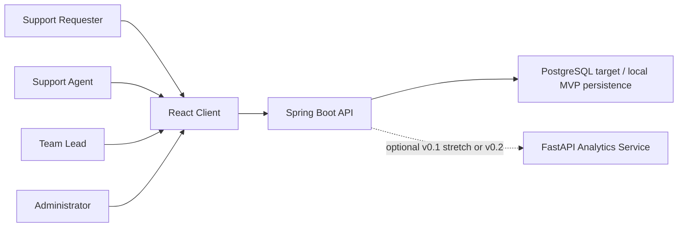
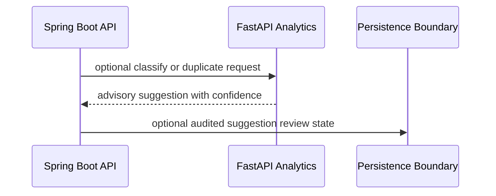

# Architecture

Current roadmap mode: `PORTFOLIO_FIRST_V0_1`.

Current status: ResolveHub is no longer planning-only. `origin/main` contains
the frontend scaffold, Spring Boot backend, auth/RBAC, ticket backend workflow,
ticket frontend workflow, Kanban, dashboard backend APIs, FastAPI health
scaffold, Docker Compose foundation, and GitHub Actions CI. Issue #22 dashboard
UI is implemented on `frontend/issue-22-dashboard-ui` and awaits PR/merge before
it becomes mainline architecture.

## System Context

```mermaid
flowchart LR
  Requester["Support Requester"] --> Frontend["React Client"]
  Agent["Support Agent"] --> Frontend
  Lead["Team Lead"] --> Frontend
  Admin["Administrator"] --> Frontend
  Frontend --> Backend["Spring Boot API"]
  Backend --> DB["PostgreSQL target / local MVP persistence"]
  Backend -. "optional v0.1 stretch or v0.2" .-> Analytics["FastAPI Analytics Service"]
```

## Implementation State

| Area | Current state |
|---|---|
| Frontend shell, routes, ticket workspace, Kanban | MERGED |
| Authentication/RBAC backend | MERGED |
| Ticket create/detail/update/search/filter backend | MERGED |
| Assignment, comments, and activity history backend | MERGED |
| Dashboard summary/trend backend APIs | MERGED |
| Dashboard UI | IMPLEMENTED_UNMERGED on Issue #22 branch |
| FastAPI analytics health scaffold | MERGED |
| Category/priority suggestion service | OPTIONAL_STRETCH via Issue #23 |
| Duplicate suggestion | DEFERRED_TO_V0_2 via Issue #24 |
| Full analytics workflow integration | DEFERRED_TO_V0_2 via Issue #25 |
| Integrated E2E/accessibility/security gates | REMAINING via scoped Issue #26 |
| Docker demo and portfolio release package | REMAINING via scoped Issue #27 |

## Frontend

The React TypeScript client owns the user-facing ticket workflow. `origin/main`
includes the ticket workspace and Kanban surface. Issue #22 adds the dashboard
route, summary tiles, distribution charts, trend buckets, and dashboard states
on its active branch. Authentication UI remains a frontend integration gap even
though backend auth/RBAC exists.

## Backend

The Spring Boot API owns authentication, authorization, ticket workflow rules,
comments, activity history, dashboard aggregation, and the source-of-truth
ticket data. `origin/main` contains the core workflow and dashboard endpoints.

## Analytics

The FastAPI analytics service currently exposes a health endpoint and package
boundary. Under `PORTFOLIO_FIRST_V0_1`, analytics is not a release blocker:

- Issue #23 category/priority suggestion service is optional stretch.
- Issue #24 duplicate suggestion is v0.2.
- Issue #25 full analytics workflow integration is v0.2.

Analytics suggestions remain advisory. They must not automatically mutate ticket
truth or store private ticket content.

## Database

PostgreSQL remains the target persistence model for users, roles, tickets,
comments, activities, assignments, categories, analytics suggestions, sessions
or refresh tokens, and audit logs. Current backend slices use local MVP
persistence where PostgreSQL integration is not yet complete.

## Docker And CI

Docker Compose and GitHub Actions foundations are present on `origin/main`.
Portfolio-first v0.1 still requires scoped #26 quality gates and #27 demo/release
validation before declaring the release complete.

## Request Flow

1. User interacts with the React client.
2. Client sends authenticated requests to the Spring Boot API where integration
   exists.
3. API validates input and enforces role permissions.
4. API persists workflow state through the current MVP persistence boundary.
5. API returns normalized data to the frontend.
6. Optional analytics requests remain stretch/v0.2 work unless explicitly
   enabled.

## Authentication Flow

1. User registers or logs in through backend auth endpoints.
2. Backend hashes passwords and issues local MVP session tokens.
3. Frontend integration for authenticated session use remains separate from the
   backend capability.
4. Backend checks role permissions on protected endpoints.
5. Logout invalidates the active session token.

## Ticket Workflow Flow

1. Requester creates a ticket.
2. Backend validates, stores, and exposes the ticket.
3. Support roles triage, assign, comment, and update status/priority.
4. Ticket mutations append activity history.
5. Kanban presents workflow state in the frontend.
6. Dashboard UI will read summary/trend APIs after #21 and #22 are complete.

## Analytics Suggestion Flow

```mermaid
sequenceDiagram
  participant API as Spring Boot API
  participant Analytics as FastAPI Analytics
  participant DB as Persistence Boundary
  API->>Analytics: optional classify or duplicate request
  Analytics-->>API: advisory suggestion with confidence
  API->>DB: optional audited suggestion review state
```

This flow is not required for Portfolio-first v0.1 unless the user explicitly
enables the #23 stretch work.

## Audit Flow

Every ticket change should append an immutable activity record with actor,
action, timestamp, changed fields, and safe request context. Activity summaries
must not expose tokens, credentials, private ticket bodies, Gmail content,
browser sessions, job-search data, or other private user data.

## Deployment Topology

The portfolio v0.1 demo target is a local Docker Compose stack with frontend,
backend, analytics health service, and database topology. A hosted public demo
is optional future work and requires HTTPS, CORS, secret management, health
checks, and rollback review.

## Trade-Offs

- A modular Spring Boot backend remains preferable to a larger microservice
  split for v0.1.
- Portfolio-first v0.1 prioritizes a coherent full-stack workflow and release
  narrative over full analytics breadth.
- Analytics remains separated so the core ticket workflow can stay reliable.
- Suggestions assist users but never automatically change ticket truth.

## Future Expansion

- Full analytics workflow integration.
- Duplicate clustering.
- SLA reporting.
- Organization-level teams.
- Notification integrations.
- More granular audit exports.
